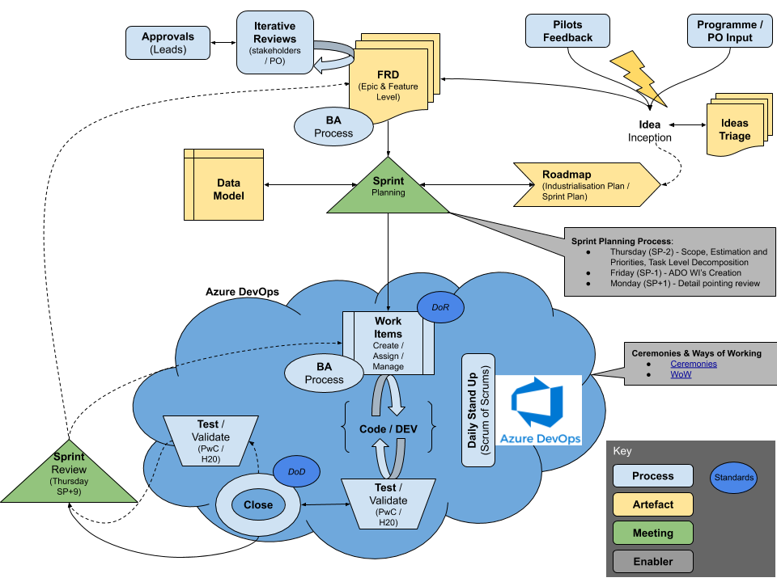

[[_TOC_]]

#Daily  Stand Up 

*The purpose of the daily stand up is to provide concise and clear updates on WI in the sprint.*

The updates should cover three main factors:

1.	What was worked on the prior day 
2.	What you are working on today 
3.	Any blockers you are facing  

 

These updates should be prepared before the call to ensure you are able to clearly update the team on updates and progress.
 
Each team will have one representative to give an update, this will often be the team lead and will collect the team updates prior to the stand up. If this member cannot tend, they should a fellow team member attend in their absence or provide an update before the meeting to the scrum master.
 

**Key points to consider when giving updates are:**
- To ensure that updates are concise, the team lead should refer to the WI ID number so its clear and easy to understand what item is being spoke to
- It is the team members responsibility to move items across the board from ‘New, In Progress, Resolved, Closed’
- Stand Ups are limited to 15mins total so typically this allows for less than 2 minutes per update
- A few pointers on style and approach: 
    - Keep updates brief and pertinent to other team members
    - The aim is to broadcast what was done, what is being worked on next and what blockers (if any) are being faced that you need support with
    - If the information is only useful to a few people on the call then it may be better to take the discussion “offline”

 

-------------

 

##Ceremony overview and meeting structure

The following document breaks down the planning, stand up, review & retrospective meetings across all projects:  [Sprints/ Scrum - Terms of reference](https://docs.google.com/spreadsheets/d/1SaEvFVEJD2xGRav6naKOOgi0JBdRp1Fh2eLvdVtQB6A/edit#gid=0)

 

##Processes and Toolingh Supporting the delivery of work for the Audit.ai Programme:

[Audit.ai Deliverable Lifecycle Workflow](https://docs.google.com/drawings/d/1x0Gi8T321o-f0kYKHQqaxH68p9CvNE4rtSJr0YXcb_M/edit?usp=sharing)

 
