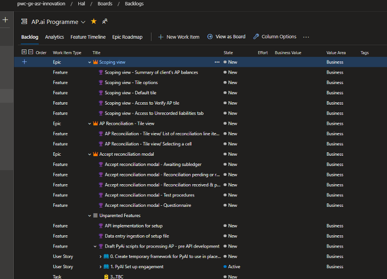

    
  

For more information on Azure DevOps as a tool see the following (external) links to get started, note there are other areas of documentation to cover test, code repos, pipeline and others: 
- [Azure DevOps](https://docs.microsoft.com/en-us/azure/devops/?view=azure-devops)
- [ADO Boards](https://docs.microsoft.com/en-us/azure/devops/boards/?view=azure-devops)

 

#Epic, Feature, Story implementation (work item heirarchy)

 
 
Prior to WI’s (Work Items) being added into ADO, the correct Product should be identified, for example. Should you wish to update the AP.ai backlog, you should find the AP.ai backlog and begin populating items in this location.
 
The wider [Audit.ai backlog](https://dev.azure.com/pwc-gx-asr-innovation/Hal/_backlogs/backlog/Audit.ai%20Programme/Stories) can be used for a view across all FSLI’s / products under the Audit.ai product.

 

 

 

#Developing a DEEP Backlog
 

To ensure ADO is built out with a defined backlog of Work Item’s (WI’s), its key to ensure clear objectives to act as a guideline. DEEP is an acronym that indicates key traits to an effective product backlog.
- ###Detailed appropriately:
  Ensure Work Items (WI) are clearly defined and details of requirements can be understood so that the business/developers can start work without additional discussion or input.

- ### Emergent: 

  WI’s are added into the backlog as new information arises, the backlog evolves and emerges over time with those at the top of the backlog having more detail than those at the bottom of the backlog. 

- ### Estimated: 
  Work items are pointed (we use story points; see the estimation wiki for more detail) in order to clearly define the estimated effort required to deliver the work item, the approach should be standardised at a team level in order to improve estimation accuracy and consistency over time.

- ###Prioritised: 
  Work items are in rank order on the backlog based on business value and risk; this is important to ensure work begins on key deliverables, this also helps with Sprint Planning and decision making when there is excess or a lack of capacity to deliver Work Items; those at the top of the backlog have the highest priority order. Note: A work item may have a priority assigned (1 being the highest) within the item itself, however, the backlog priority order is the preferred prioritisation mechanism.

 
 

**Below is a break down of each DEEP section to explain the process within ADO to follow out these steps:**
 

------------
 

## Detailed Appropriately
We use the [Agile process in Azure DevOps](https://docs.microsoft.com/en-us/azure/devops/boards/work-items/about-work-items?view=azure-devops&tabs=agile-process#wit) which breaks work items and organises them as follows; for more on this see [ADO Defining Features and Epics](https://docs.microsoft.com/en-us/azure/devops/boards/backlogs/define-features-epics?view=azure-devops&tabs=agile-process):

**Work Item definition and hierarchy**:

 

**Epic:** This is the overall objective that you are delivering; used as a broader grouping of work items required to deliver a significant component of the overall product. An epic typically represents a business initiative to be accomplished.
 
**Feature:** This will break down the key deliverables of the Epic to ensure the business objectives can be achieved; a feature typically represents a function or module of software that forms part of the overall epic or business need.
 
**Story:** Within each feature, work items are defined to achieve the functionality delivered and to represent the user requirement at a more granular level; user stories typically represent a specific user need with a strong focus on the customer “persona”. 
 
**Task:** A task is simply a break-down of work that needs to be completed in order to achieve the delivery of the Story. 
 
**Bug:** A bug tracks identified bugs (broken or non working function) or defects (functionality not aligned with acceptance criteria) identified during manual or automated testing processes.

 
  
 

 
