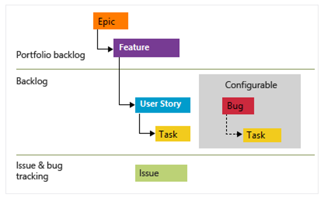
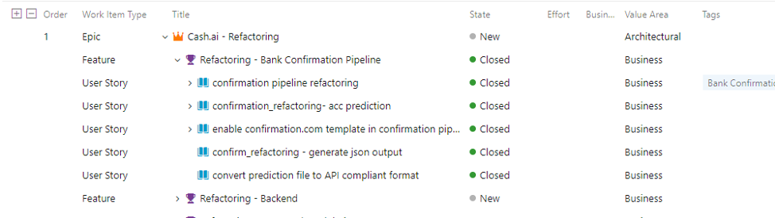
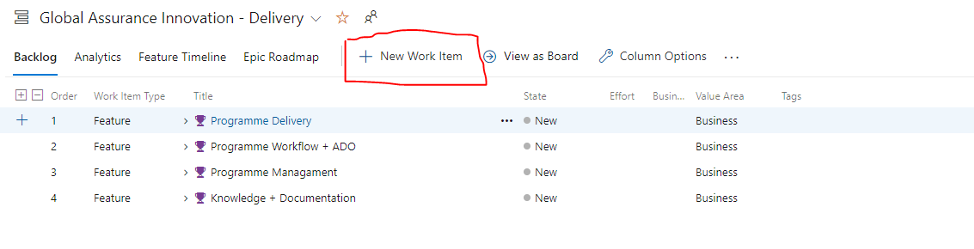
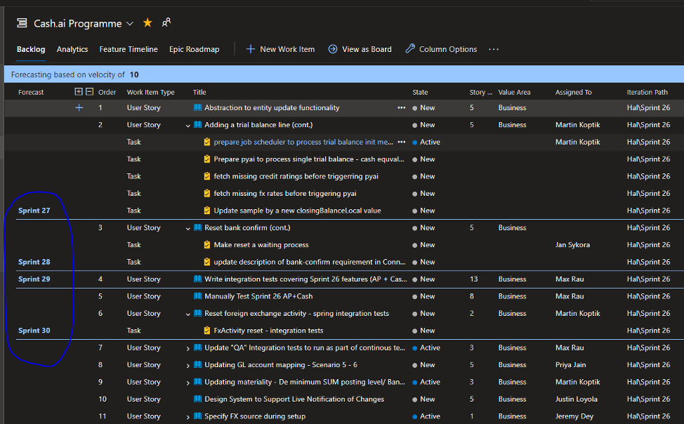
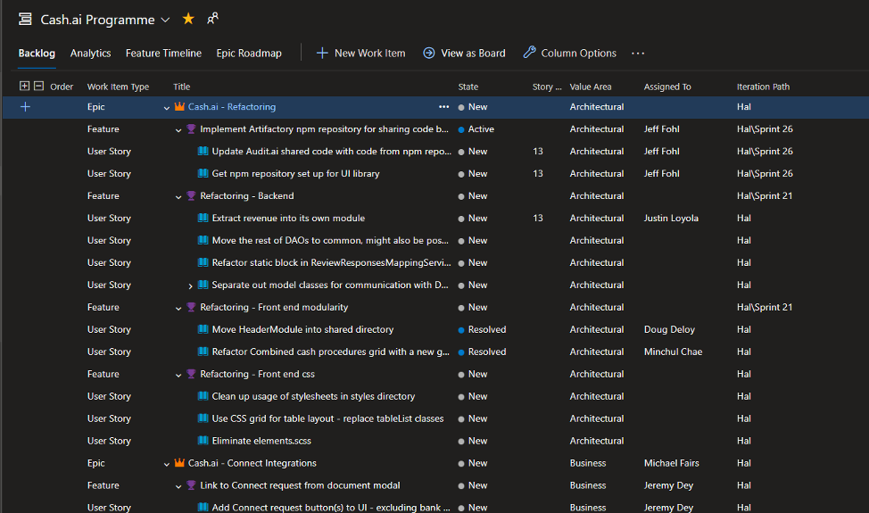

[[_TOC_]]

    
  

For more information on Azure DevOps as a tool see the following (external) links to get started, note there are other areas of documentation to cover test, code repos, pipeline and others: 
- [Azure DevOps](https://docs.microsoft.com/en-us/azure/devops/?view=azure-devops)
- [ADO Boards](https://docs.microsoft.com/en-us/azure/devops/boards/?view=azure-devops)

 

#Epic, Feature, Story implementation (work item heirarchy)

 
 
Prior to WI’s (Work Items) being added into ADO, the correct Product should be identified, for example. Should you wish to update the AP.ai backlog, you should find the AP.ai backlog and begin populating items in this location.
 
The wider [Audit.ai backlog](https://dev.azure.com/pwc-gx-asr-innovation/Hal/_backlogs/backlog/Audit.ai%20Programme/Stories) can be used for a view across all FSLI’s / products under the Audit.ai product.

 

 

 

#Developing a DEEP Backlog
 

To ensure ADO is built out with a defined backlog of Work Item’s (WI’s), its key to ensure clear objectives to act as a guideline. DEEP is an acronym that indicates key traits to an effective product backlog.
- **Detailed appropriately**:
  Ensure Work Items (WI) are clearly defined and details of requirements can be understood so that the business/developers can start work without additional discussion or input.

- **Emergent**: 

  WI’s are added into the backlog as new information arises, the backlog evolves and emerges over time with those at the top of the backlog having more detail than those at the bottom of the backlog. 

- **Estimated**: 
  Work items are pointed (we use story points; see the estimation wiki for more detail) in order to clearly define the estimated effort required to deliver the work item, the approach should be standardised at a team level in order to improve estimation accuracy and consistency over time.

- **Prioritised**: 
  Work items are in rank order on the backlog based on business value and risk; this is important to ensure work begins on key deliverables, this also helps with Sprint Planning and decision making when there is excess or a lack of capacity to deliver Work Items; those at the top of the backlog have the highest priority order. Note: A work item may have a priority assigned (1 being the highest) within the item itself, however, the backlog priority order is the preferred prioritisation mechanism.

 
 

**Below is a break down of each DEEP section to explain the process within ADO to follow out these steps:**
 

------------
 

## Detailed Appropriately
  

We use the [Agile process in Azure DevOps](https://docs.microsoft.com/en-us/azure/devops/boards/work-items/about-work-items?view=azure-devops&tabs=agile-process#wit) which breaks work items and organises them as follows; for more on this see [ADO Defining Features and Epics](https://docs.microsoft.com/en-us/azure/devops/boards/backlogs/define-features-epics?view=azure-devops&tabs=agile-process):

  

**Work Item definition and hierarchy**:

 

**Epic:** This is the overall objective that you are delivering; used as a broader grouping of work items required to deliver a significant component of the overall product. An epic typically represents a business initiative to be accomplished.
 
**Feature:** This will break down the key deliverables of the Epic to ensure the business objectives can be achieved; a feature typically represents a function or module of software that forms part of the overall epic or business need.
 
**Story:** Within each feature, work items are defined to achieve the functionality delivered and to represent the user requirement at a more granular level; user stories typically represent a specific user need with a strong focus on the customer “persona”. 
 
**Task:** A task is simply a break-down of work that needs to be completed in order to achieve the delivery of the Story. 
 
**Bug:** A bug tracks identified bugs (broken or non working function) or defects (functionality not aligned with acceptance criteria) identified during manual or automated testing processes.

 
  
 

 

###A focus on Azure DevOps User Stories

Ideally stories should be created and linked to a feature delivery to visualise all requirements required to deliver a feature(s). A story would be created by the developers & product owners. Collaborating to ensure that both Business and Technical requirements are documented and understood.
 
*What should this process look like?*
Product owners should be defining the product they wish to deliver for management/stakeholders. Once high level requirements are defined within the FRD document, the developers should be included into the review sessions to raise work items, potential blockers & additional items/considerations to factor in.
 

*Where would this be managed?*

ADO is the best location to document and manage the feature and story creation, once a feature is documented we are able to build out user stories within it to define the deliverables required to ensure the feature is delivered.

  

As seen above, it's clearly visible that the EPIC Cash.ai - Refactoring is our objective, to deliver that objective we have multiple features. Refactoring - Bank Confirmation Pipeline is one feature required to deliver the EPIC, therefore to ensure we meet the features requirements it would be essential to to document story items to ensure the feature can be delivered with all requirements met.
 
The backlog ordering (priority ordering) can also be set at this stage to reflect the most important work items at the top of the backlog and those that may be addressed later at the bottom of the backlog.

 

-------
 

##Emergent 

*Adding Work Items to the backlog as new requirements and information emerges:*
 
ADO has multiple ways of adding items, the preferred method would be adding them directly into a backlog.
 
As mentioned above, prior to adding a WI into ADO you must confirm the application/team that your item will be in relation to.
 
Go to the backlog item located under Board within ADO (Seen below)

   

After arriving on the backlog of choice, select the top right hand corner of the page and select the Work Item type you wish to add:

    

 
Once confirmed, select ‘+ New Work Item’. 

    
   
    
 
 

-----------------
 

##Estimated  

The common practice when estimating effort required to deliver WI’s is using the Fibonacci Sequence. 
See Wiki Article: [Agile Estimating](https://dev.azure.com/pwc-gx-asr-innovation/Hal/_wiki/wikis/Hal.wiki/15/Agile-Estimating)

 

  
 
This should be used to estimate the effort required to complete a WI. 

1 Point is seen as half a day's work, 2 Points is seen as a day's work, 3 Points is seen as a day and a half etc. This should be the consistent method of estimation across all applications and will be tracked in reports and stand ups. 

 

**How do we add points?**

Upon creating a story, you would be required to point up the effort required to complete the WI. To add a point estimation to an item, select the chosen story within ADO and click the box seen below named ‘Story Points’. From here you can add in your Fibonacci estimate and it will automatically save.

    
 

 

-------

 

## Prioritised 

Work items should be in backlog rank order (Azure DevOps calls this "stack rank" order) on the backlog based on business value and risk; this is important to ensure work begins on key deliverables, this also helps with Sprint Planning and decision making when there is excess or a lack of capacity to deliver Work Items; those at the top of the backlog have the highest priority order. 

 

An example of this ordering is shown below: 

Note: A work item may have a priority assigned (1 being the highest) within the work item itself on the "priority attribute" field, however, the backlog priority order is the preferred prioritisation mechanism.

 
 

**Why prioritise?**

Once you have a prioritised, estimated and detailed backlog that is continually refined (built upon and developed on a regular basis, **preferably via frequent (at least weekly) backlog refinement meetings** with the PO / project owners) then the Sprint Planning process becomes a lot easier. You can use the built in ADO Velocity forecasting tool to help indicate what work items can be accomodated in upcoming sprints based on the work items estimated sizing.
 
A view of an example backlog with forecasting turned on is shown below which indicates when each work item can be accommodated in terms of upcoming iterations (a.k.a. sprints): 

   

 

It is worth noting that you cannot use the velocity based forecasting tool when you have the parent / hierarchy view (i.e. showing which epic and feature a story belongs to) in Azure DevOps; these are mutually exclusive views (but you can still prioritise by forced rank ordering within a feature or epic, just not across the entire backlog in this view): 

  

 