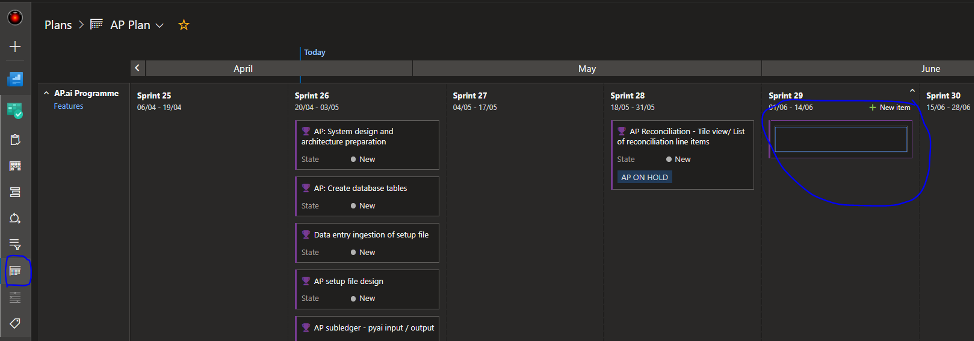
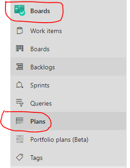

[[_TOC_]]

# Sprint Planning

Once you have a populated backlog of organised, detailed and estimated work items broken down at the epic, feature and story level you can use a few approaches to planning an upcoming sprint: 

 

**1. Plan from the Hierarchy / Parents view;** this allows you to focus on the epic to feature relationship within the backlog. Once you have identified the features you wish to allocate to a sprint you can multi select these (`ctrl+ctrl / shift + mouse click`) and then `right click` to edit the Iteration Path field to the appropriate sprint.

 
 
 
 

**2. Plan from the Feature Timeline view;** this allows you to *select existing* features that are not currently allocated to a sprint and to drag and drop them (swimlane splits on the page are by Epic); note that in this view the feature is able to span multiple sprints. Note that this view does not allow the creation of new features directly, but just the allocation of already existing features to an upcoming sprint.

  

 
 
 

**3. Plan from the “Plans” view;** this allows you to view upcoming sprints and create new features within each Sprint easily and quickly. This view also allows you to move features which are already allocated to one sprint to another sprint and to directly drill down to underlying stories.

  
 

 
 

-----------------

 

#Epics & Feature Roadmaps
 
Epics will both assist with delivery categories and managing/planning the project & programme roadmaps.
 

 To provide the most accurate sense of delivery timelines, ADO allows us to use the backlog as a golden single source of data which can populate multiple diagrams, charts and dashboards.

  
 
  
  
   

Above is the Programme level view that can assist with visualising timelines for Epics, reflecting on progress and cu, if the programme is on track and what is upcoming. 

 

This can be accessed by going to ADO, selecting boards and then selecting Portfolio Plans.

  

 

For a more detailed and granular view, you can select Boards and then Plans. With this, you will be provided a sprint based roadmap of feature delivery.
 
   

 

Upon selection, you will be provided the below view breaking down feature delivery per sprint. 

  

These views are ideal for demonstrating future deliveries and reporting progress to peers, management or stakeholders.
 
Note that in the “Plan” view you can also directly add features and assign these to sprints which can be extremely helpful when planning sprint themes before features are then broken down into stories and tasks, i.e. this allows you to start with the “big picture” before focusing in on the detailed requirements of what needs to be developed to meet those customer needs. 

 
 
------------