# Ways of Working (WoW Article)
  

#### A list of rules, expectations, and procedures to help govern how teams will work together

## The Agreement
Ways of working can "loosely" be defined as a list of rules, expectations, and procedures that govern how teams will work together.
- Outside of the scrum framework but can be used by a lot of team members
- Accessible and visible (not dogmatic -  a dynamic, living document)
- Simply an agreement that “I do my part to make things happen”
- Help new team members to understand the project, team mindset (easy for many of us who have been on the project for quite some time to take this for granted)

**The WoW is not meant to dictate** precisely how work gets done, but more to keep everyone maximumly productive and positive. 
**A WoW can be whatever we want it to be** and include whatever we collectively agree to include: ie:  how we communicate with one another, processes, etc. 
**It’s essentially what we're looking to accomplish** and what the expectations are as part of the team. 
Making certain assumptions, identifying challenges => facilitate conversation, change and update as needed...

##Two key elements:
####1. Definition of Ready (DOR)
**Definition of Ready** - as applies to User Stories 
When is a User story Ready?
Who, What, Why
- Who is the customer: Who is going to use it; who are the end-users?
- What do they want?
- Why do they need it?

Acceptance Criteria:
- Needs to be in place before a developer even picks up the work
- Explicit
- Clear, concise and actionable
- Polished and non-ambiguous

What specifically needs to be done and the level of complexity of the work?

####2. Definition of Done (DOD)
**Definition of Done** - how do we know when we are done? 
(No such thing as almost done - almost there) 
What does it mean to get a story done?
- The User Story meets the acceptance criteria
- Unit testing
- Code reviews, peer reviews
- Integration testing (this user story didn't break other features)
- Lightweight documentation of what was done (product owner for final review; where applicable)
- Ready for PwC to QA Test

## Breaking down the process of delivering items within Azure DevOps
    
For more information on Azure DevOps as a tool see the following (external) links to get started, note there are other areas of documentation to cover test, code repos, pipeline and others: 
- [Azure DevOps](https://docs.microsoft.com/en-us/azure/devops/?view=azure-devops)
- [ADO Boards](https://docs.microsoft.com/en-us/azure/devops/boards/?view=azure-devops)

####Epic, Feature, Story implementation

Prior to WI’s (Work Items) being added into ADO, the correct Product should be identified, for example. Should you wish to update the AP.ai backlog, you should find the AP.ai backlog and begin populating items in this location.
 
The wider [Audit.ai backlog](https://dev.azure.com/pwc-gx-asr-innovation/Hal/_backlogs/backlog/Audit.ai%20Programme/Stories) can be used for a view across all FSLI’s / products under the Audit.ai product.

 

 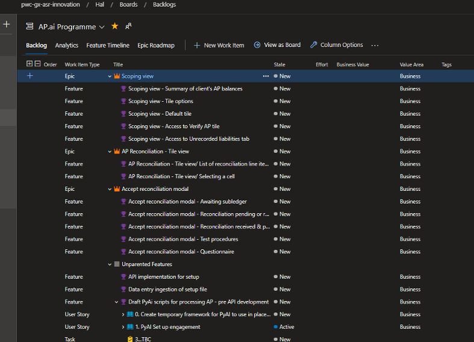

####DEEP Backlog

To ensure ADO is built out with a defined backlog of Work Item’s (WI’s), its key to ensure clear objectives to act as a guideline. DEEP is an acronym that indicates key traits to an effective product backlog.
- Detailed appropriately: Ensure Work Items (WI) are clearly defined and details of requirements can be understood so that the business/developers can start work without additional discussion or input.
- Emergent: WI’s are added into the backlog as new information arises, the backlog evolves and emerges over time with those at the top of the backlog having more detail than those at the bottom of the backlog. 
- Estimated: Work items are pointed (we use story points; see the estimation wiki for more detail) in order to clearly define the estimated effort required to deliver the work item, the approach should be standardised at a team level in order to improve estimation accuracy and consistency over time..
- Prioritised: Work items are in rank order on the backlog based on business value and risk; this is important to ensure work begins on key deliverables, this also helps with Sprint Planning and decision making when there is excess or a lack of capacity to deliver Work Items; those at the top of the backlog have the highest priority order. Note: A work item may have a priority assigned (1 being the highest) within the item itself, however, the backlog priority order is the preferred prioritisation mechanism.

 

**Below is a break down of each DEEP section to explain the process within ADO to follow out these steps:**
 

 
#### Detailed Appropriately
We use the [Agile process in Azure DevOps](https://docs.microsoft.com/en-us/azure/devops/boards/work-items/about-work-items?view=azure-devops&tabs=agile-process#wit) which breaks work items and organises them as follows; for more on this see [ADO Defining Features and Epics](https://docs.microsoft.com/en-us/azure/devops/boards/backlogs/define-features-epics?view=azure-devops&tabs=agile-process):

**Work Item definition and hierarchy**:

**Epic:** This is the overall objective that you are delivering; used as a broader grouping of work items required to deliver a significant component of the overall product. An epic typically represents a business initiative to be accomplished.

**Feature:** This will break down the key deliverables of the Epic to ensure the business objectives can be achieved; a feature typically represents a function or module of software that forms part of the overall epic or business need.

**Story:** Within each feature, work items are defined to achieve the functionality delivered and to represent the user requirement at a more granular level; user stories typically represent a specific user need with a strong focus on the customer “persona”. 

**Task:** A task is simply a break-down of work that needs to be completed in order to achieve the delivery of the Story. 

**Bug:** A bug tracks identified defects identified during manual or automated testing processes.

 
 

 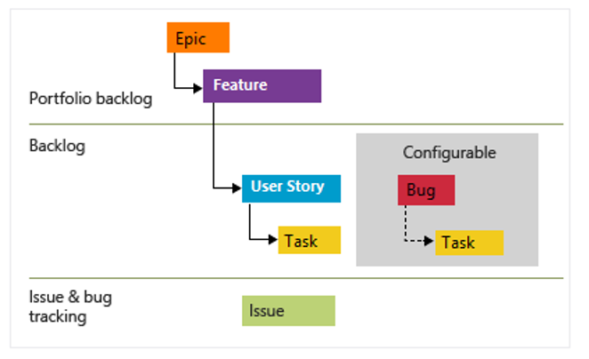

####Epics & Feature Roadmaps
Epics will both assist with delivery categories and managing/planning the project & programme roadmaps.
 
To provide the most accurate sense of delivery timelines, ADO allows us to use the backlog as a golden single source of data which can populate multiple diagrams, charts and dashboards.

  
 
  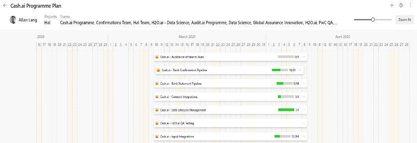
  
   

Above is the Programme level view that can assist with visualising timelines for Epics, reflecting on progress and cu, if the programme is on track and what is upcoming. This can be accessed by going to ADO, selecting boards and then selecting Portfolio Plans.

 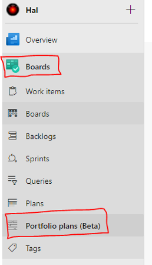 

 

For a more detailed and granular view, you can select Boards and then Plans. With this, you will be provided a sprint based roadmap of feature delivery.
 
  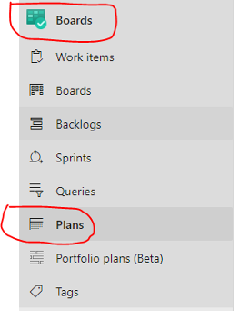 

 

Upon selection, you will be provided the below view breaking down feature delivery per sprint. 

 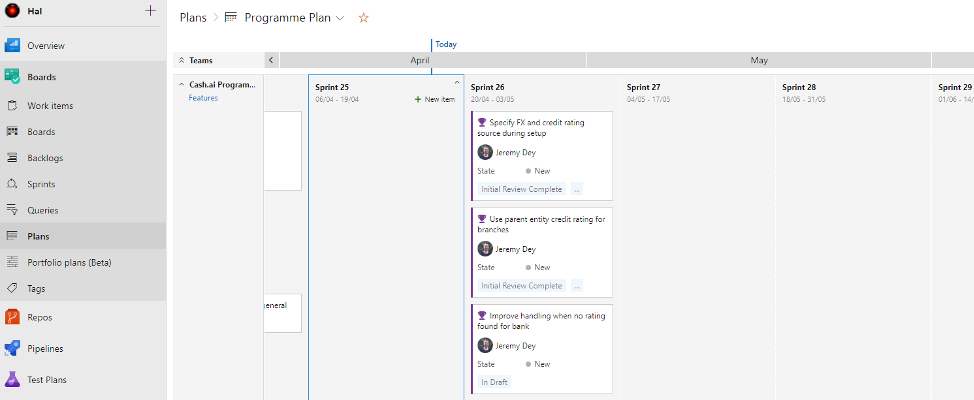 

These views are ideal for demonstrating future deliveries and reporting progress to peers, management or stakeholders.
 
Note that in the “Plan” view you can also directly add features and assign these to sprints which can be extremely helpful when planning sprint themes before features are then broken down into stories and tasks, i.e. this allows you to start with the “big picture” before focusing in on the detailed requirements of what needs to be developed to meet those customer needs. 

 

####Azure DevOps Stories

Ideally stories should be created and linked to a feature delivery to visualise all requirements required to deliver a feature(s).
 

A story would be created by the developers & product owners. Collaborating to ensure that both Business and Technical requirements are documented and understood.
 
**What should this process look like?**
Product owners should be defining the product they wish to deliver for management/stakeholders. Once high level requirements are defined within the FRD document, the developers should be included into the review sessions to raise work items, potential blockers & additional items/considerations to factor in.
 

**Where would this be managed?**

ADO is the best location to document and manage the feature and story creation, once a feature is documented we are able to build out user stories within it to define the deliverables required to ensure the feature is delivered.

  

As seen above, it's clearly visible that the EPIC Cash.ai - Refactoring is our objective, to deliver that objective we have multiple features. Refactoring - Bank Confirmation Pipeline is one feature required to deliver the EPIC, therefore to ensure we meet the features requirements it would be essential to to document story items to ensure the feature can be delivered with all requirements met.
 
The backlog ordering (priority ordering) can also be set at this stage to reflect the most important work items at the top of the backlog and those that may be addressed later at the bottom of the backlog.

####Emergent

**Adding Work Items to the backlog as new requirements and information emerges:**

ADO has multiple ways of adding items, the preferred method would be adding them directly into a backlog.
 
As mentioned above, prior to adding a WI into ADO you must confirm the application/team that your item will be in relation to.
 
Go to the backlog item located under Board within ADO (Seen below)

  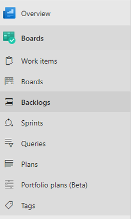 

After arriving on the backlog of choice, select the top right hand corner of the page and select the Work Item type you wish to add:

   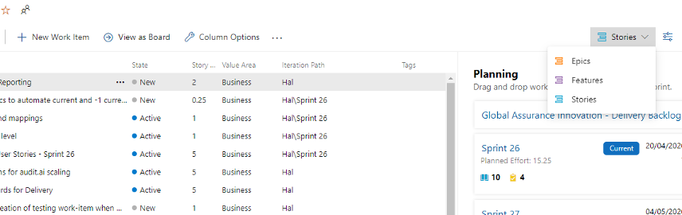 

 
Once confirmed, select ‘+ New Work Item’. 

   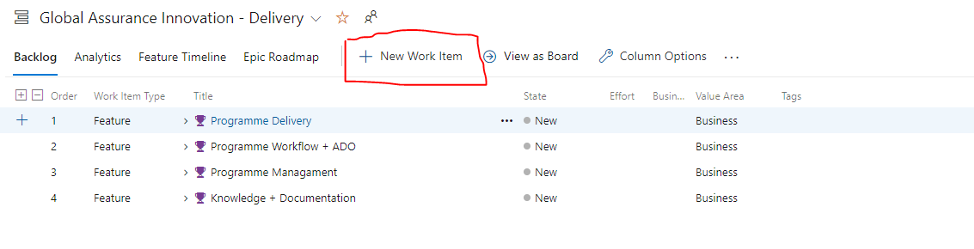 
   
   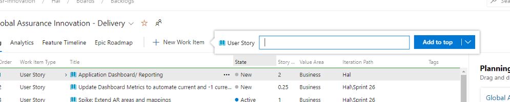 
 
 

 ####Estimated

The common practice when estimating effort required to deliver WI’s is using the Fibonacci Sequence. 
See Wiki Article: [Agile Estimating](https://dev.azure.com/pwc-gx-asr-innovation/Hal/_wiki/wikis/Hal.wiki/15/Agile-Estimating)
  
 
This should be used to estimate the effort required to complete a WI. 

1 Point is seen as half a day's work, 2 Points is seen as a day's work, 3 Points is seen as a day and a half etc. This should be the consistent method of estimation across all applications and will be tracked in reports and stand ups. 

 

**How do we add points?**

Upon creating a story, you would be required to point up the effort required to complete the WI. To add a point estimation to an item, select the chosen story within ADO and click the box seen below named ‘Story Points’. From here you can add in your Fibonacci estimate and it will automatically save.

   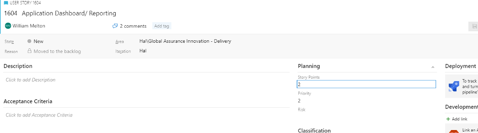 
 

 #### Prioritised 

Work items should be in rank order on the backlog based on business value and risk; this is important to ensure work begins on key deliverables, this also helps with Sprint Planning and decision making when there is excess or a lack of capacity to deliver Work Items; those at the top of the backlog have the highest priority order. 
 
Note: A work item may have a priority assigned (1 being the highest) within the item itself, however, the backlog priority order is the preferred prioritisation mechanism. 

**Why prioritise?**
Once you have a prioritised, estimated and detailed backlog that is continually refined (built upon and developed on a regular basis) then the Sprint Planning process becomes a lot easier. You can use the built in ADO Velocity forecasting tool to help indicate what work items can be accomodated in upcoming sprints based on the work items estimated sizing.
 
A view of an example backlog with forecasting turned on is shown below which indicates when each work item can be accommodated in terms of upcoming iterations (a.k.a. sprints): 

   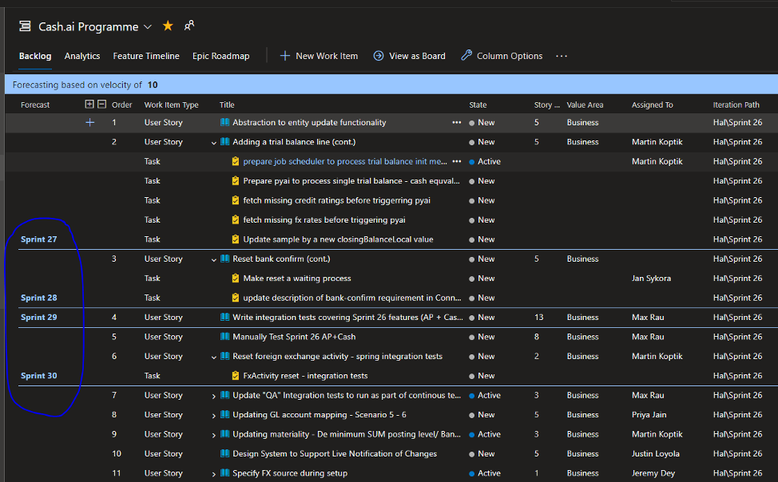

 

It is worth noting that you cannot use the velocity based forecasting tool when you have the parent / hierarchy view (i.e. showing which epic and feature a story belongs to) in Azure DevOps; these are mutually exclusive views (but you can still prioritise by forced rank ordering within a feature or epic, just not across the entire backlog in this view): 

  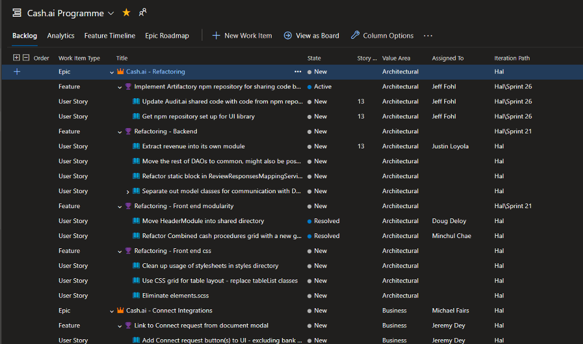

 

####Sprint Planning

Once you have a populated backlog of organised, detailed and estimated work items broken down at the epic, feature and story level you can use a few approaches to planning an upcoming sprint: 

**1. Plan from the Hierarchy / Parents view;** this allows you to focus on the epic to feature relationship within the backlog. Once you have identified the features you wish to allocate to a sprint you can multi select these (ctrl+ mouse click) and then right click to edit the Iteration Path field to the appropriate sprint.

 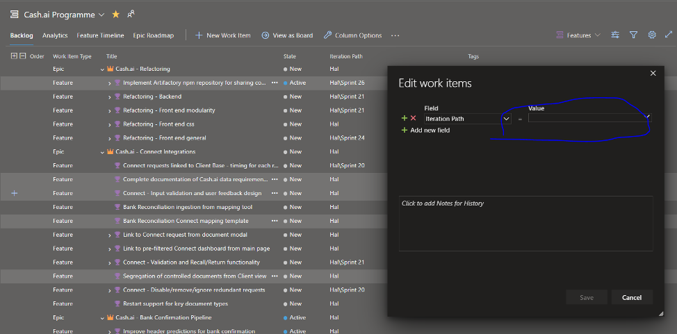
 
 

**2. Plan from the Feature Timeline view;** this allows you to *select existing* features that are not currently allocated to a sprint and to drag and drop them (swimlane splits on the page are by Epic); note that in this view the feature is able to span multiple sprints. Note that this view does not allow the creation of new features directly, but just the allocation of already existing features to an upcoming sprint.

  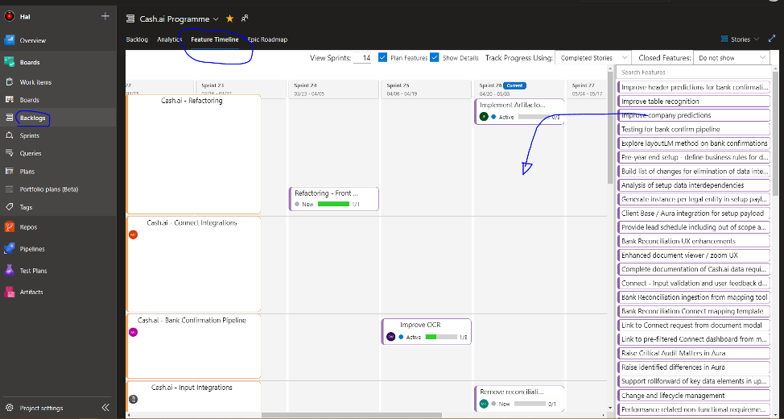

 

**3. Plan from the “Plans” view;** this allows you to view upcoming sprints and create new features within each Sprint easily and quickly. This view also allows you to move features which are already allocated to one sprint to another sprint and to directly drill down to underlying stories.

  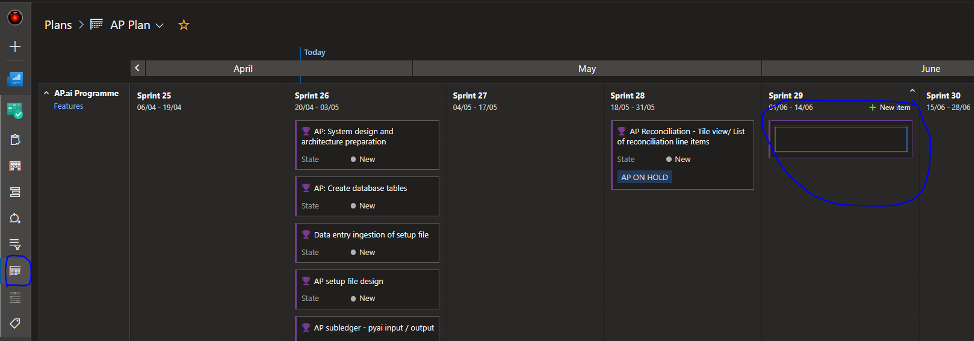
 

 

 
####SCRUM Stand Up 

**The purpose of the daily stand up is to provide concise and clear updates on WI in the sprint.** 

The updates should cover three main factors:

1.	What was worked on the prior day 
2.	What you are working on today 
3.	Any blockers you are facing  

These updates should be prepared before the call to ensure you are able to clearly update the team on updates and progress.
 
Each team will have one representative to give an update, this will often be the team lead and will collect the team updates prior to the stand up. If this member cannot tend, they should a fellow team member attend in their absence or provide an update before the meeting to the scrum master.
 

**Key points to consider when giving updates are:**
- To ensure that updates are concise, the team lead should refer to the WI ID number so its clear and easy to understand what item is being spoke to
- It is the team members responsibility to move items across the board from ‘New, In Progress, Resolved, Closed’
- Stand Ups are limited to 15mins total so typically this allows for less than 2 minutes per update
- A few pointers on style and approach: 
    - Keep updates brief and pertinent to other team members
    - The aim is to broadcast what was done, what is being worked on next and what blockers (if any) are being faced that you need support with
    - If the information is only useful to a few people on the call then it may be better to take the discussion “offline”

